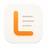
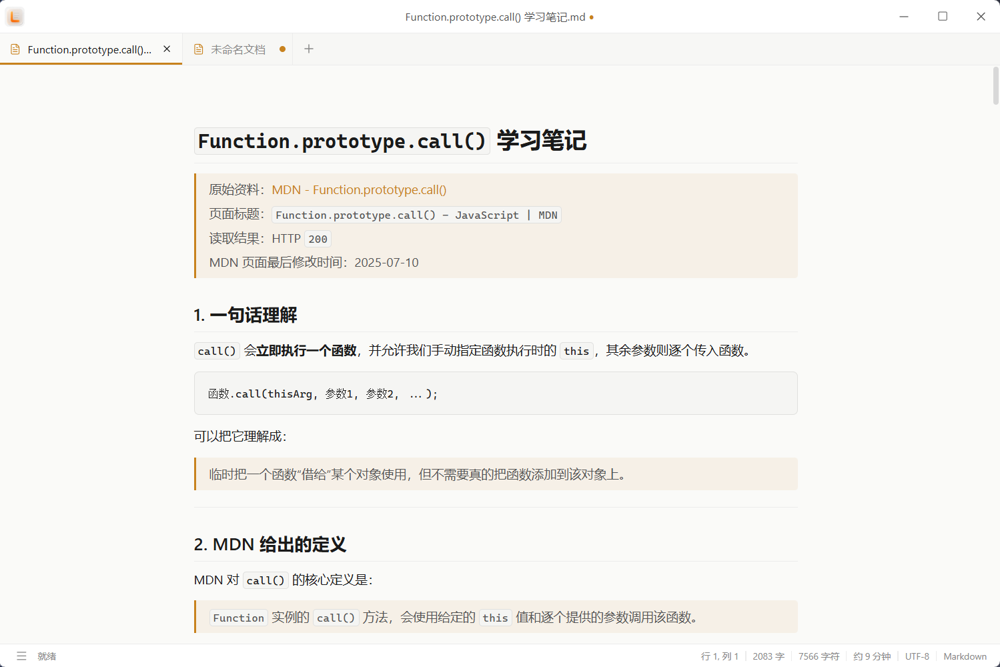
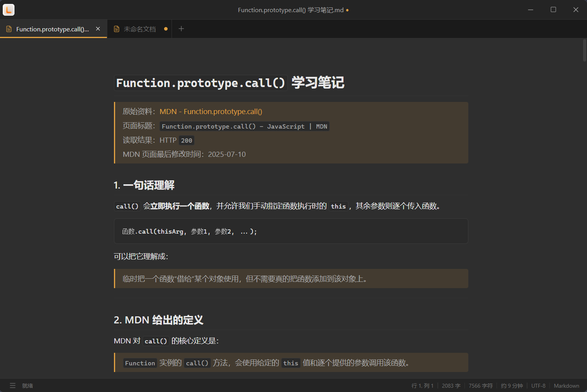
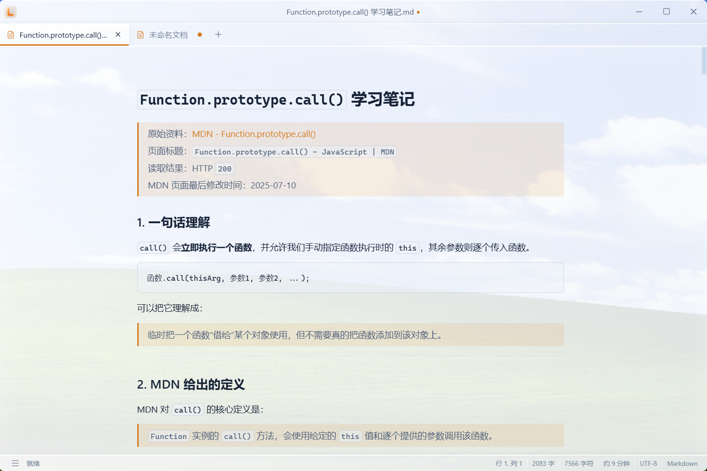

# Lume

**一款安静、轻盈、专注于本地写作的 Markdown 编辑器。**

让文字留在自己的设备里，让写作回归内容本身。

[界面预览](#界面预览) · [体验亮点](#体验亮点) · [项目进度](#项目进度) · [参与项目](#参与项目)

---

## 关于 Lume

Lume 是为个人写作与本地知识整理打造的桌面编辑器。

它直接使用普通的 Markdown 文件，不要求登录账号，不把内容锁进专有格式，也不会改变你原有的文档管理方式。无论是随手记录、学习笔记，还是长期文章，都可以在一个简洁、舒适的空间里完成。

> 你的文字属于你。随时打开，随时迁移，长期可读。

## 界面预览

Lume 提供明亮、沉静与朦胧三种不同氛围，让写作空间适应你的环境与心情。

### 浅色主题

清爽自然，适合白天与明亮环境下的长时间写作。

### 深色主题

沉静克制，减少暗光环境下的视觉干扰。

### 毛玻璃主题

柔和通透，在保持内容清晰的同时呈现轻盈的层次感。

## 体验亮点

| 体验 | 说明 |
| --- | --- |
| ✍️ **专注写作** | 克制的界面与舒适的正文宽度，让注意力始终停留在文字上 |
| 📄 **本地优先** | 直接打开和保存本地 Markdown 文件，不依赖账号与在线服务 |
| ✨ **两种编辑方式** | 在所见即所得与源码分栏之间自由切换，兼顾流畅输入与精细控制 |
| 🗂️ **多文档工作** | 使用标签页同时处理多篇内容，快速切换并清楚识别未保存状态 |
| 🌗 **舒适外观** | 提供浅色、深色、跟随系统与毛玻璃外观，适应不同环境与偏好 |
| 📊 **写作状态** | 实时显示字数、字符数、阅读时长与光标位置，掌握当前写作进度 |

## 适合用来做什么

- 记录灵感、日记与日常随笔
- 整理课程、阅读和技术学习笔记
- 撰写博客、文章与长篇内容
- 管理可以长期保存和迁移的 Markdown 文档
- 在不连接云服务的情况下安静写作

## 设计原则

| 原则 | 含义 |
| --- | --- |
| **本地优先** | 内容保存在自己的设备中，由自己掌控 |
| **Markdown 优先** | 文件保持开放、可读、可迁移 |
| **写作优先** | 输入体验与内容表达高于功能堆叠 |
| **简单可靠** | 用清晰的交互完成常用工作 |
| **渐进增强** | 在稳定基础体验之上谨慎增加能力 |

## 项目进度

Lume 目前处于早期开发阶段，已经可以完成本地 Markdown 文档的新建、打开、编辑与保存，并支持多标签、未保存提醒、会话恢复、主题切换和基础写作统计。

接下来将继续完善：

- 工作区与文件树
- 自动保存与外部修改提醒
- 文档搜索、替换与大纲
- 表格、任务列表等扩展内容
- 图片与附件管理
- HTML 与 PDF 导出

详细计划请查看 [产品与开发路线图](docs/roadmap.md)。

## 参与项目

欢迎提交问题、分享使用感受或参与改进。无论是一个交互建议、一处文案修正，还是一个新的使用场景，都能帮助 Lume 变得更好。

- 开始参与前，请阅读 [开发说明](docs/development.md)
- 想了解后续方向，请查看 [产品与开发路线图](docs/roadmap.md)
- 发现问题时，请尽量附上复现步骤、系统环境与相关截图

## 当前说明

> Lume 尚未发布稳定版本，界面、功能和文档仍可能调整。重要文档请保留独立备份。

## 许可证

本项目采用 [PolyForm Noncommercial License 1.0.0](LICENSE.md)。

- 允许个人学习、研究、实验、业余项目及其他非商业用途
- 允许在非商业目的下修改和分发，但必须保留许可证及相关声明
- **禁止将本项目或其衍生作品用于商业用途**
- 商业授权需求请联系项目作者另行取得许可

> 由于许可证限制商业用途，本项目属于源码可见项目，不属于 OSI 定义的开源软件。

---

**Lume · 为文字留一束安静的光。**
