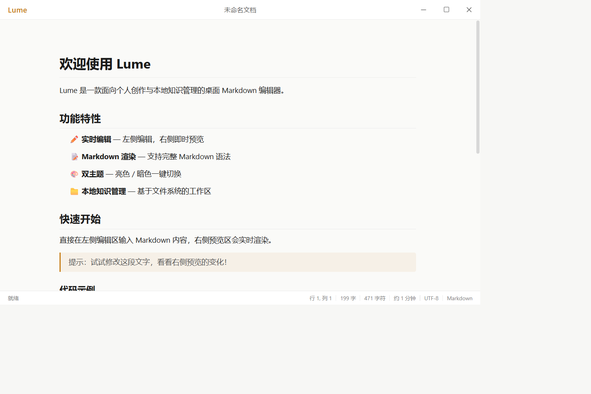
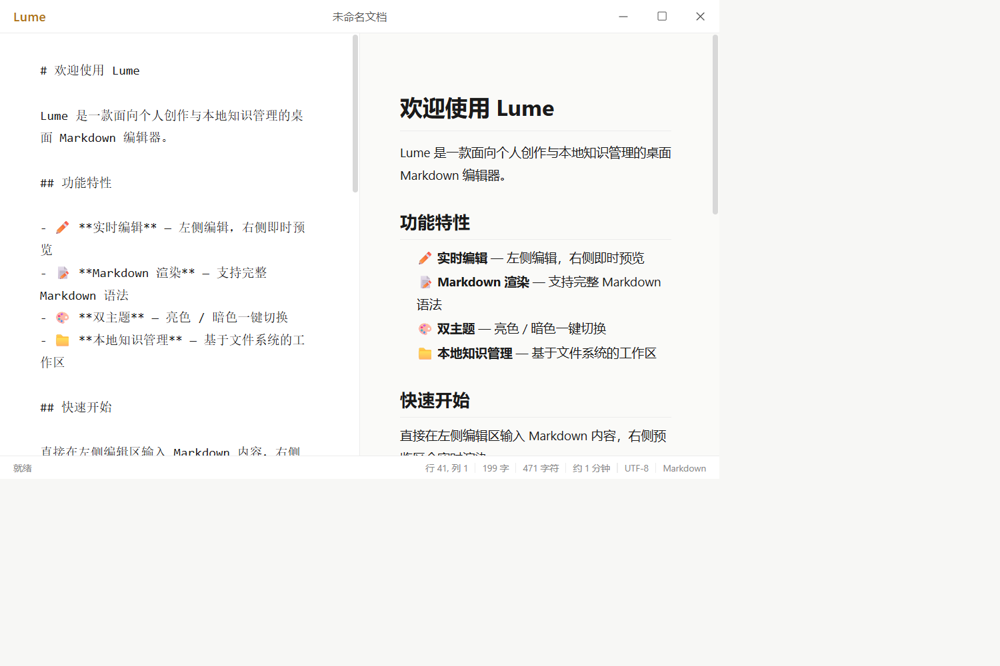

# Lume

面向个人写作与本地知识管理的桌面 Markdown 编辑器。

Lume 以本地 Markdown 文件为内容来源，默认提供 Markdown-first 所见即所得编辑，也可以随时切换为源码与实时预览分栏。文档保持为普通 `.md` 文件，不依赖云端账号或私有格式。

> Lume 目前处于早期开发阶段，界面和功能仍在持续调整。

## 界面预览

### 所见即所得

直接在排版后的文档中写作，Markdown 快捷输入、选区、撤销和输入法由 Milkdown / ProseMirror 处理。



### Markdown 与实时预览

点击标题栏左侧的 **Lume**，可以切换到 Markdown 源码与实时预览分栏。



## 当前能力

- Markdown-first 所见即所得编辑。
- Markdown 源码与实时预览分栏。
- 标题、列表、引用、强调和代码块等基础语法。
- 本地 Markdown 文件的新建、打开与保存。
- 字数、字符数、阅读时长和光标位置统计。
- 无系统装饰的桌面窗口与原生窗口控制。
- 浏览器开发预览和 Tauri 桌面运行模式。

## 技术栈

| 模块 | 技术 |
| --- | --- |
| 桌面应用 | Tauri 2 + Rust |
| 前端 | Vue 3 + TypeScript + Vite |
| 所见即所得编辑 | Milkdown + ProseMirror |
| 分栏预览 | markdown-it |
| 原生文件能力 | Tauri Dialog / FS 插件 |
| 图标 | Lucide |

## 快速开始

### 环境要求

- Node.js 20+
- npm 10+
- Rust 1.77+ 与 Cargo
- Windows 下需要 Visual Studio C++ Build Tools 和 Windows SDK

### 安装依赖

```powershell
npm install
```

### 浏览器开发

```powershell
npm run dev
```

浏览器模式适合开发界面和编辑器，但原生窗口控制与完整文件系统能力仅在 Tauri 中可用。

### 桌面应用开发

```powershell
npm run tauri:dev
```

### 类型检查与构建

```powershell
npm run type-check
npm run build
npm run tauri:build
```

Windows Rust/MSVC 环境配置、目录结构和常用命令请参阅 [开发说明](docs/development.md)。

## 项目状态

当前重点是完善单文档编辑闭环，包括保存保护、常用快捷键、Markdown 往返一致性和自动化测试。工作区文件树、文件监听、全文搜索、导出和扩展语法仍在规划中。

完整阶段目标与架构方向参阅 [产品与开发路线图](docs/roadmap.md)。

## 文档

- [开发环境与项目结构](docs/development.md)
- [产品原则与开发路线图](docs/roadmap.md)

## 许可证

许可证尚未确定。在许可证文件加入仓库前，请勿默认将本项目视为开源授权软件。
