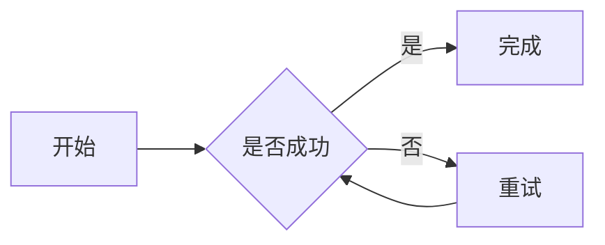

# Markdown 扩展手动验收

本文档用于验收 Phase 3 新增的 KaTeX、Mermaid、脚注和代码语法高亮能力。每次扩展实现或依赖升级后，应在 Tauri 桌面模式下执行相关清单；全部通过后再更新[重构计划](refactoring-plan.md)中的完成状态。

## 通用准备

1. 新建一个未保存文档并切换到源码模式。
2. 粘贴对应扩展的测试内容。
3. 依次切换源码、WYSIWYG 和 Preview 模式。
4. 保存文档，关闭标签后重新打开。
5. 再次切换三个模式，确认 Markdown 没有非预期变化。

## KaTeX

测试内容：

```markdown
行内公式：$E = mc^2$。

$$
x = \frac{-b \pm \sqrt{b^2 - 4ac}}{2a}
$$
```

验收清单：

- [ ] 从源码切换到 WYSIWYG 后，行内和块级公式均正确渲染。
- [ ] Preview 中的公式语义、大小和布局与 WYSIWYG 一致。
- [ ] 在 WYSIWYG 中完整键入 `$E = mc^2$`，最后一个 `$` 输入后转换为公式节点。
- [ ] 粘贴完整的 `$E = mc^2$` 时转换为行内公式节点。
- [ ] 在空段落粘贴完整的 `$$...$$` 时转换为块级公式节点。
- [ ] 普通货币文本、转义美元符号和包含公式的混合粘贴不会被错误转换。
- [ ] 保存并重新打开后，LaTeX 内容和分隔符保持一致。
- [ ] 非法 LaTeX 不导致编辑器崩溃，并显示可识别的错误结果。

## Mermaid

测试内容：

````markdown

````

验收清单：

- [ ] WYSIWYG 将 Mermaid 保持为语言标记为 `mermaid` 的可编辑代码块。
- [ ] 源码模式完整保留围栏、语言标记和图表源码。
- [ ] Preview 异步渲染为 SVG，节点和连线内容正确。
- [ ] 亮色、暗色和玻璃主题下图表均清晰可读。
- [ ] Mermaid 语法错误时保留源码回退，不清空 Preview 或阻塞其他内容。
- [ ] 快速连续修改 Mermaid 源码时，仅最新一次渲染结果生效。
- [ ] 保存并重新打开后，图表源码保持一致。

## 脚注

测试内容：

```markdown
Lume 支持 Markdown 脚注。[^lume]

这里还有另一个脚注。[^second]

[^lume]: Lume 是一个本地 Markdown 编辑器。
[^second]: 脚注可以包含中文和 **Markdown 格式**。
```

验收清单：

- [ ] WYSIWYG 正确显示脚注引用和脚注定义。
- [ ] 源码模式完整保留脚注标识符、引用和定义。
- [ ] Preview 生成连续编号、脚注列表和返回链接。
- [ ] 点击引用可定位定义，点击返回链接可回到原引用。
- [ ] 多次引用同一脚注时编号和返回链接正确。
- [ ] 未定义引用和未引用定义不会导致内容丢失。
- [ ] 保存并重新打开后，脚注标识符和内容保持一致。

## 代码语法高亮

测试内容：

````markdown
```typescript
const greeting: string = 'Hello, Lume'
console.log(greeting)
```

```rust
fn main() {
    println!("Hello, Lume!");
}
```

```unknown-language
plain fallback
```
````

验收清单：

- [ ] WYSIWYG 中代码块保持可编辑，语言标记和内容不丢失。
- [ ] Preview 中 TypeScript 和 Rust 代码出现语义化高亮。
- [ ] 亮色和暗色主题下代码颜色及背景均清晰可读。
- [ ] 未知语言安全回退为纯文本代码块。
- [ ] Mermaid 代码块由 Mermaid 扩展处理，不被 Shiki 截获。
- [ ] 保存并重新打开后，围栏、语言标记和代码内容保持一致。

## 性能与稳定性

准备一个至少包含 10 个 Mermaid 图表、20 个带语言代码块、20 个公式和 20 个脚注的文档，然后执行：

- [ ] 在 WYSIWYG 普通段落中连续输入中文 30 秒，无明显输入延迟或丢字。
- [ ] 在 WYSIWYG 中撤销和重做普通文本时，无明显停顿。
- [ ] 未进入 Preview 前，Mermaid 和 Shiki 不执行图表渲染或代码高亮。
- [ ] 首次进入 Preview 时允许短暂异步加载，但界面不冻结且可继续滚动。
- [ ] 快速切换文档或连续编辑时，不出现旧 Mermaid 或 Shiki 结果覆盖新内容。
- [ ] 反复切换 Preview 10 次后，无持续增长的错误日志或明显性能退化。
- [ ] 一个扩展渲染失败时，其他 Markdown 内容和扩展仍能正常显示。

## 验收结果

- 验收日期：
- 验收平台：
- 应用版本：
- 执行人：
- 未通过项及复现步骤：
